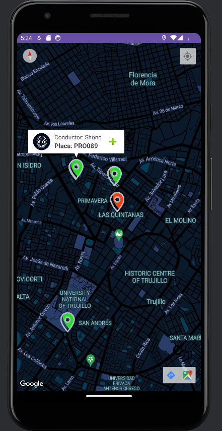

# Hawkeye-Cliente :police_car:
Versión para el cliente de la aplicación Hawkeye.

**Hawkeye** es una aplicación móvil diseñada para facilitar la conexión entre los ciudadanos y las autoridades policiales. Esta versión permite a los policías ver la ubicación de los usuarios en viaje, obtener detalles sobre el viaje y acceder a información adicional sobre los vehículos.

## Estado del Proyecto :construction:
Esta es una versión funcional pero en desarrollo de HawkEye para la policía. Aunque la funcionalidad principal está implementada, el diseño visual y algunas características adicionales están en proceso de mejora. Agradecemos cualquier sugerencia para optimizar la experiencia del usuario.

## Aplicación Policía :police_car:
### HawkEye-Policía
La app para policías permite:
- Ver la ubicación de los usuarios que han iniciado un viaje.
- Consultar el nombre del conductor y la placa del vehículo.
- Ampliar la información de cada usuario (presionar en la ventana flotante) para ver detalles del punto de origen y destino del viaje.
- Buscar la placa del vehículo en una base de datos mediante un botón “Buscar placa”. Este botón está presente en la interfaz, pero la funcionalidad de búsqueda aún no está implementada.

**Nota**: Algunas interfaces y elementos visuales pueden cambiar en versiones futuras. La funcionalidad de búsqueda de placa está planeada para ser implementada en futuras actualizaciones.

## Reconocimientos :handshake:

- **Programación**: Esta versión fue desarrollada íntegramente por mí, Estefano Quito Villanueva, quien se encargó de toda la programación y la implementación de las funcionalidades principales de la aplicación.
- **Colaboradores**:
  - **Farfan Arroyo Henry Marcell**: Desarrolló la versión final de la aplicación, incorporando elementos visuales adicionales y extendiendo la funcionalidad. Mejoró significativamente la interfaz de usuario, refinó la experiencia visual y también implementó varias mejoras funcionales, logrando una versión casi completa y pulida del proyecto.
  - **Bautista Rodriguez Ricardo; Castillo Idrogo Robinson y Gallardo Aguilar Aldo**: Contribuyeron significativamente en el inicio del proyecto, incluyendo la identificación de requisitos funcionales y no funcionales, la elaboración de diagramas (de flujo, de bases de datos, etc.), y la creación de toda la documentación necesaria para el desarrollo. También colaboraron en la definición de prototipos y en el desarrollo de historias de usuario.
 
## Capturas de Pantalla :camera:

### Pantalla Principal

### Vista de Datos

